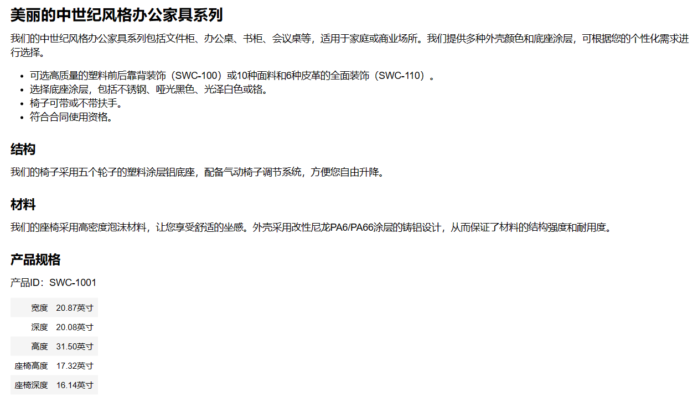

# Chapter01 ChatGPT基础操作
## 1.1 账号及API接口注册流程
- [中国区注册OpenAI账号教程参考](https://readdevdocs.com/blog/makemoney/%E4%B8%AD%E5%9B%BD%E5%8C%BA%E6%B3%A8%E5%86%8COpenAI%E8%B4%A6%E5%8F%B7%E8%AF%95%E7%94%A8ChatGPT%E6%8C%87%E5%8D%97.html#%E5%89%8D%E6%9C%9F%E5%87%86%E5%A4%87)
- 遇到Access denied、不支持地区等连接问题，尝试更换代理。
- [OpenAI API接口获取方法](https://zhuanlan.zhihu.com/p/613782276)
- [ProxyError错误解决方法](https://zhuanlan.zhihu.com/p/350015032)

## 1.2 API基本使用方法
- 安装 `openai` 工具包
```powershell
pip install openai
```
- 导入工具包
```python
import openai
OPENAI_API_KEY = "填入专属的API key"
openai.api_key = OPENAI_API_KEY
```
- `Completion` 接口(可以理解为续写)：
    - model：指定的模型，[可调用模型参考资料](https://zhuanlan.zhihu.com/p/608309509)。
    - prompt：提示，默认为 `<|endoftext|>`，它是模型在训练期间看到的文档分隔符，因此如果未指定Prompt，模型将像从新文档的开始一样。简单来说，就是给模型的提示语。
    - max_tokens：生成的最大Token数，默认为16。
    - temperature：采样温度，默认为1，介于0和2之间。通常建议调整这个参数或下面的top_p，但不能同时更改两者。
    - top_p：采样topN分布，默认为1。0.1意味着Next Token只选择前10%概率的。
    - stop：停止的Token或序列，默认为null，最多4个，如果遇到该Token或序列就停止继续生成。注意生成的结果中不包含stop。
    - presence_penalty：存在惩罚，默认为0，介于-2.0和2.0之间的数字。正值会根据新Token到目前为止是否出现在文本中来惩罚它们，从而增加模型讨论新主题的可能性。
    - frequency_penalty：频率惩罚，默认为0，介于-2.0和2.0之间的数字。正值会根据新Token到目前为止在文本中的现有频率来惩罚新Token，降低模型重复生成同一行的可能性。
```python
def complete(prompt):
    response = openai.Completion.create(
      model="text-davinci-003",                     # 模型引擎
      prompt=prompt,                                # 提的问题
      temperature=0,                                # 生成文本时的随机性、多样性
      max_tokens=64,                                # 生成文本的最长长度
      top_p=1.0,
      frequency_penalty=0.0,
      presence_penalty=0.0
    )
    ans = response.choices[0].text
    return ans
```
- `ChatGPT Style` (可以理解为对话，也就是ChatGPT，有关提示词可以参考[Prompt 工程](https://yam.gift/2023/01/25/NLP/2023-01-25-ChatGPT-Prompt-Engineering/))：
    - model：指定的模型，gpt-3.5-turbo就是ChatGPT。
    - messages：会话消息，支持多轮，多轮就是多条。每一条消息为一个字典，包含「role」和「content」两个字段。如：[{"role": "user", "content": "Hello!"}]
    - 其他参数与 `Completion` 接口中类似。
```python
def get_completion(content):
    response = openai.ChatCompletion.create(
        model="gpt-3.5-turbo", 
        messages=[{"role": "user", "content": content}]
    )
    ans = response.get("choices")[0].get("message").get("content")
    return ans
```
- 多轮对话函数(注意以下方法会带来额外的tokens消耗，因为每次传入的tokens包含了之前的所有tokens)
```python
class Chat:
    def __init__(self,conversation_list=[]):
        self.conversation_list = []

    def show_conversation(self,msg_list):
        for msg in msg_list:
            if msg['role'] == 'user':
                print(f"问: {msg['content']}\n")
            else:
                print(f"答: {msg['content']}\n")

    def ask(self,prompt):
        self.conversation_list.append({"role":"user","content":prompt})
        response = openai.ChatCompletion.create(model="gpt-3.5-turbo",messages=self.conversation_list)
        answer = response.choices[0].message['content']
        self.conversation_list.append({"role":"assistant","content":answer})
        self.show_conversation(self.conversation_list)
```

## 1.3 ChatGPT使用技巧
### 1.3.1 编写prompt原则
#### 原则1：编写清晰，具体的指令
- 方法1：使用特殊符号、分隔符等，例如：`"""`、`'''`、`---`、`<>`、`<tag><\tag>`
```python
text = f"""
你应该提供尽可能清晰、具体的指示，以表达你希望模型执行的任务。\
这将引导模型朝向所需的输出，并降低收到无关或不正确响应的可能性。\
不要将写清晰的提示与写简短的提示混淆。\
在许多情况下，更长的提示可以为模型提供更多的清晰度和上下文信息，从而导致更详细和相关的输出。
"""
# 需要总结的文本内容
prompt = f"""
把用三个反引号括起来的文本总结成一句话。
```{text}```
"""
# 指令内容，使用 ``` 来分隔指令和待总结的内容
response = get_completion(prompt)
print(response)
```
- 方法2：进行结构化输出，例如：HTML格式、Json等格式
```python
prompt = f"""
请生成包括书名、作者和类别的三本虚构书籍清单，\
并以 JSON 格式提供，其中包含以下键:book_id、title、author、genre。
"""
response = get_completion(prompt)
print(response)
```
- 方法3：要求模型检查是否满足条件
```python
text_1 = f"""
泡一杯茶很容易。首先，需要把水烧开。\
在等待期间，拿一个杯子并把茶包放进去。\
一旦水足够热，就把它倒在茶包上。\
等待一会儿，让茶叶浸泡。几分钟后，取出茶包。\
如果你愿意，可以加一些糖或牛奶调味。\
就这样，你可以享受一杯美味的茶了。
"""
prompt = f"""
您将获得由三个引号括起来的文本。\
如果它包含一系列的指令，则需要按照以下格式重新编写这些指令：

第一步 - ...
第二步 - …
…
第N步 - …

如果文本中不包含一系列的指令，则直接写“未提供步骤”。"
\"\"\"{text_1}\"\"\"
"""
response = get_completion(prompt)
print("Text 1 的总结:")
print(response)
```
- 方法4：提供少量示例
```python
prompt = f"""
你的任务是以一致的风格回答问题。

<孩子>: 教我耐心。

<祖父母>: 挖出最深峡谷的河流源于一处不起眼的泉眼；最宏伟的交响乐从单一的音符开始；最复杂的挂毯以一根孤独的线开始编织。

<孩子>: 教我韧性。
"""
response = get_completion(prompt)
print(response)
```

#### 原则2：给模型时间去思考(chain of thought)
- 方法1：指定完成任务所需的步骤
```python
text = f"""
在一个迷人的村庄里，兄妹杰克和吉尔出发去一个山顶井里打水。\
他们一边唱着欢乐的歌，一边往上爬，\
然而不幸降临——杰克绊了一块石头，从山上滚了下来，吉尔紧随其后。\
虽然略有些摔伤，但他们还是回到了温馨的家中。\
尽管出了这样的意外，他们的冒险精神依然没有减弱，继续充满愉悦地探索。
"""
# example 1
prompt_2 = f"""
1-用一句话概括下面用<>括起来的文本。
2-将摘要翻译成英语。
3-在英语摘要中列出每个名称。
4-输出一个 JSON 对象，其中包含以下键：English_summary，num_names。

请使用以下格式：
文本：<要总结的文本>
摘要：<摘要>
翻译：<摘要的翻译>
名称：<英语摘要中的名称列表>
输出 JSON：<带有 English_summary 和 num_names 的 JSON>

Text: <{text}>
"""
response = get_completion(prompt_2)
print("\nprompt 2:")
print(response)
```
- 方法2：指导模型在下结论之前找出一个自己的解法
```python
prompt = f"""
请判断学生的解决方案是否正确，请通过如下步骤解决这个问题：

步骤：

    首先，自己解决问题。
    然后将你的解决方案与学生的解决方案进行比较，并评估学生的解决方案是否正确。在自己完成问题之前，请勿决定学生的解决方案是否正确。

使用以下格式：

    问题：问题文本
    学生的解决方案：学生的解决方案文本
    实际解决方案和步骤：实际解决方案和步骤文本
    学生的解决方案和实际解决方案是否相同：是或否
    学生的成绩：正确或不正确

问题：

    我正在建造一个太阳能发电站，需要帮助计算财务。 
    - 土地费用为每平方英尺100美元
    - 我可以以每平方英尺250美元的价格购买太阳能电池板
    - 我已经谈判好了维护合同，每年需要支付固定的10万美元，并额外支付每平方英尺10美元
    作为平方英尺数的函数，首年运营的总费用是多少。

学生的解决方案：

    设x为发电站的大小，单位为平方英尺。
    费用：
    1. 土地费用：100x
    2. 太阳能电池板费用：250x
    3. 维护费用：100,000+100x
    总费用：100x+250x+100,000+100x=450x+100,000

实际解决方案和步骤：
"""
response = get_completion(prompt)
print(response)
```

#### 局限性
- 模型偶尔会生成一些看似真实实则编造的知识。
- 一种减少虚假输出的策略是先要求模型找到文本中的任何相关引用，然后要求它使用这些引用来回答问题，这种追溯源文档的方法通常对减少编造非常有帮助。

### 1.3.2 迭代式提示开发
- 在运用ChatGPT解决问题时，迭代的改进我们的prompt来逐步实现功能，以下述"椅子的产品说明书"为例：
```python
# 示例：产品说明书
fact_sheet_chair = """
概述

    美丽的中世纪风格办公家具系列的一部分，包括文件柜、办公桌、书柜、会议桌等。
    多种外壳颜色和底座涂层可选。
    可选塑料前后靠背装饰（SWC-100）或10种面料和6种皮革的全面装饰（SWC-110）。
    底座涂层选项为：不锈钢、哑光黑色、光泽白色或铬。
    椅子可带或不带扶手。
    适用于家庭或商业场所。
    符合合同使用资格。

结构

    五个轮子的塑料涂层铝底座。
    气动椅子调节，方便升降。

尺寸

    宽度53厘米|20.87英寸
    深度51厘米|20.08英寸
    高度80厘米|31.50英寸
    座椅高度44厘米|17.32英寸
    座椅深度41厘米|16.14英寸

选项

    软地板或硬地板滚轮选项。
    两种座椅泡沫密度可选：中等（1.8磅/立方英尺）或高（2.8磅/立方英尺）。
    无扶手或8个位置PU扶手。

材料
外壳底座滑动件

    改性尼龙PA6/PA66涂层的铸铝。
    外壳厚度：10毫米。
    座椅
    HD36泡沫

原产国

    意大利
"""
```
```python
# 提示：基于说明书创建营销描述
prompt = f"""
你的任务是帮助营销团队基于技术说明书创建一个产品的营销描述。

根据```标记的技术说明书中提供的信息，编写一个产品描述。

技术说明: {fact_sheet_chair}
"""
response = get_completion(prompt)
print(response)
```
```markup
我们很自豪地向您介绍我们的美丽中世纪风格办公家具系列，其中包括文件柜、办公桌、书柜、会议桌等。该系列可选多种外壳颜色和底座涂层，以满足您对家具风格和颜色的不同要求。

我们还提供SWC-100塑料前后靠背装饰和SWC-110全面装饰，前者可以让您感受到舒适与实用的完美结合，后者则可以让您享受到更高档次的享受。底座涂层有不锈钢、哑光黑色、光泽白色或铬可供选择。椅子可带或不带扶手，适用于家庭或商业场所，并符合合同使用资格。

此外，我们的椅子采用五个轮子的塑料涂层铝底座，气动椅子调节，方便升降。可以自由选择软地板或硬地板滚轮选项，并提供两种座椅泡沫密度可选：中等（1.8磅/立方英尺）或高（2.8磅/立方英尺）。如果您需要，还可以选择无扶手或8个位置PU扶手。

我们的椅子尺寸为宽度53厘米，深度51厘米，高度80厘米，座椅高度44厘米，座椅深度41厘米。外壳底座滑动件采用改性尼龙PA6/PA66涂层的铸铝，并采用10毫米厚度外壳，座椅材质为HD36泡沫。

我们引以为豪的美丽中世纪风格办公家具系列供您选择，原产自意大利，以优良的工艺和材料为基础，为您创造出独一无二的办公空间。
```

#### 问题1：生成文本太长
```python
# 优化后的 Prompt，要求生成描述不多于 50 词
prompt = f"""
您的任务是帮助营销团队基于技术说明书创建一个产品的零售网站描述。

根据```标记的技术说明书中提供的信息，编写一个产品描述。

使用最多50个词。

技术规格：```{fact_sheet_chair}```
"""
response = get_completion(prompt)
print(response)
```
```markup
中世纪风格办公家具系列，包括文件柜、办公桌、书柜、会议桌等。外壳颜色、底座涂层、装饰和椅子可选。铝底座、气动调节、轮子选项。高质量材料，适用于家庭或商业场所。意大利制造，符合合同使用资格。
```

#### 问题2：文本关注在错误的细节上
```python
# 优化后的 Prompt，说明面向对象，应具有什么性质且侧重于什么方面
prompt = f"""
您的任务是帮助营销团队基于技术说明书创建一个产品的零售网站描述。

根据```标记的技术说明书中提供的信息，编写一个产品描述。

该描述面向家具零售商，因此应具有技术性质，并侧重于产品的材料构造。

使用最多50个单词。

技术规格： ```{fact_sheet_chair}```
"""
response = get_completion(prompt)
print(response)
```
```markup
这款美丽的中世纪风格办公家具系列包括文件柜、办公桌、书柜和会议桌等，底座可选不锈钢、哑光黑色、光泽白色或铬。椅子可带或不带扶手，适用于家庭或商业场所。提供软地板或硬地板滚轮选项，两种座椅泡沫密度可选。该产品由意大利制造，满足合同使用资格。
```
```python
# 更进一步
prompt = f"""
您的任务是帮助营销团队基于技术说明书创建一个产品的零售网站描述。

根据```标记的技术说明书中提供的信息，编写一个产品描述。

该描述面向家具零售商，因此应具有技术性质，并侧重于产品的材料构造。

在描述末尾，包括技术规格中每个7个字符的产品ID。

使用最多50个单词。

技术规格： ```{fact_sheet_chair}```
"""
response = get_completion(prompt)
print(response)
```
```markup
我们很高兴推出我们的中世纪风格办公家具系列，包括文件柜、办公桌、书柜和会议桌等。我们提供多种颜色和涂层选项，包括底座涂层，如不锈钢、哑光黑色、光泽白色或铬。您可以选择我们的SWC-100塑料前后靠背装饰或SWC-110的10种面料和6种皮革的全面装饰。椅子可选带或不带扶手，适用于家庭或商业场所，并符合合同使用规格。在结构方面，我们使用五个轮子的塑料涂层铝底座和气动椅子调节，方便升降。我们还提供软地板或硬地板滚轮选项和两种座椅泡沫密度可选。外壳底座滑动件采用改性尼龙PA6/PA66涂层的铸铝，外壳厚度为10毫米。座椅材料为HD36泡沫，原产国为意大利。产品ID：SWC-100或SWC-110。
```

#### 问题3：需要一个表格形式的描述
```python
# 要求它抽取信息并组织成表格，并指定表格的列、表名和格式
prompt = f"""
您的任务是帮助营销团队基于技术说明书创建一个产品的零售网站描述。

根据```标记的技术说明书中提供的信息，编写一个产品描述。

该描述面向家具零售商，因此应具有技术性质，并侧重于产品的材料构造。

在描述末尾，包括技术规格中每个7个字符的产品ID。

在描述之后，包括一个表格，提供产品的尺寸。表格应该有两列。第一列包括尺寸的名称。第二列只包括英寸的测量值。

给表格命名为“产品尺寸”。

将所有内容格式化为可用于网站的HTML格式。将描述放在<div>元素中。

技术规格：```{fact_sheet_chair}```
"""

response = get_completion(prompt)
# 表格是以 HTML 格式呈现的，加载出来
from IPython.display import display, HTML
display(HTML(response))
```



### 1.3.3 文本转换
#### 文本翻译
- 中文转西班牙语
```python
prompt = f"""
将以下中文翻译成西班牙语: \ 
```您好，我想订购一个搅拌机。```
"""
response = get_completion(prompt)
print(response)
```
```markup
Hola, me gustaría ordenar una batidora.
```
- 识别语种
```python
prompt = f"""
请告诉我以下文本是什么语种: 
```Combien coûte le lampadaire?```
"""
response = get_completion(prompt)
print(response)
```
```markup
这是法语。
```
- 多语种翻译
```python
prompt = f"""
请将以下文本分别翻译成中文、英文、法语和西班牙语: 
```I want to order a basketball.```
"""
response = get_completion(prompt)
print(response)
```
```markup
中文：我想订购一个篮球。
英文：I want to order a basketball.
法语：Je veux commander un ballon de basket-ball.
西班牙语：Quiero pedir una pelota de baloncesto.
```
- 翻译+正式语气
```python
prompt = f"""
请将以下文本翻译成中文，分别展示成正式与非正式两种语气: 
```Would you like to order a pillow?```
"""
response = get_completion(prompt)
print(response)
```
```markup
正式语气：请问您需要订购枕头吗？
非正式语气：你要不要订一个枕头？
```
- 通用翻译器
```python
user_messages = [
  "La performance du système est plus lente que d'habitude.",  # System performance is slower than normal         
  "Mi monitor tiene píxeles que no se iluminan.",              # My monitor has pixels that are not lighting
  "Il mio mouse non funziona",                                 # My mouse is not working
  "Mój klawisz Ctrl jest zepsuty",                             # My keyboard has a broken control key
  "我的屏幕在闪烁"                                             # My screen is flashing
]

for issue in user_messages:
    prompt = f"告诉我以下文本是什么语种，直接输出语种，如法语，无需输出标点符号: ```{issue}```"
    lang = get_completion(prompt)
    print(f"原始消息 ({lang}): {issue}\n")

    prompt = f"""
    将以下消息分别翻译成英文和中文，并写成
    中文翻译：xxx
    英文翻译：yyy
    的格式：
    ```{issue}```
    """
    response = get_completion(prompt)
    print(response, "\n=========================================")
```
```markup
原始消息 (法语): La performance du système est plus lente que d'habitude.

中文翻译：系统性能比平时慢。
英文翻译：The system performance is slower than usual. 
=========================================
原始消息 (西班牙语): Mi monitor tiene píxeles que no se iluminan.

中文翻译：我的显示器有一些像素点不亮。
英文翻译：My monitor has pixels that don't light up. 
=========================================
原始消息 (意大利语): Il mio mouse non funziona

中文翻译：我的鼠标不工作了。
英文翻译：My mouse is not working. 
=========================================
原始消息 (波兰语): Mój klawisz Ctrl jest zepsuty

中文翻译：我的Ctrl键坏了
英文翻译：My Ctrl key is broken. 
=========================================
原始消息 (中文): 我的屏幕在闪烁

中文翻译：我的屏幕在闪烁。
英文翻译：My screen is flickering. 
=========================================
```

#### 语气/风格调整
```python
prompt = f"""
将以下文本翻译成商务信函的格式: 
```小老弟，我小羊，上回你说咱部门要采购的显示器是多少寸来着？```
"""
response = get_completion(prompt)
print(response)
```
```markup
尊敬的XXX（收件人姓名）：

您好！我是XXX（发件人姓名），在此向您咨询一个问题。上次我们交流时，您提到我们部门需要采购显示器，但我忘记了您所需的尺寸是多少英寸。希望您能够回复我，以便我们能够及时采购所需的设备。

谢谢您的帮助！

此致

敬礼

XXX（发件人姓名）
```

#### 格式转换
```python
data_json = { "resturant employees" :[ 
    {"name":"Shyam", "email":"shyamjaiswal@gmail.com"},
    {"name":"Bob", "email":"bob32@gmail.com"},
    {"name":"Jai", "email":"jai87@gmail.com"}
]}

prompt = f"""
将以下Python字典从JSON转换为HTML表格，保留表格标题和列名：{data_json}
"""
response = get_completion(prompt)
print(response)
```
```markup
<table>
  <tr>
    <th>resturant employees</th>
  </tr>
  <tr>
    <td>name</td>
    <td>email</td>
  </tr>
  <tr>
    <td>Shyam</td>
    <td>shyamjaiswal@gmail.com</td>
  </tr>
  <tr>
    <td>Bob</td>
    <td>bob32@gmail.com</td>
  </tr>
  <tr>
    <td>Jai</td>
    <td>jai87@gmail.com</td>
  </tr>
</table>
```
```python
from IPython.display import display, Markdown, Latex, HTML, JSON
display(HTML(response))
```


#### 拼写及语法纠正
```python
text = [ 
  "The girl with the black and white puppies have a ball.",  # The girl has a ball.
  "Yolanda has her notebook.", # ok
  "Its going to be a long day. Does the car need it’s oil changed?",  # Homonyms
  "Their goes my freedom. There going to bring they’re suitcases.",  # Homonyms
  "Your going to need you’re notebook.",  # Homonyms
  "That medicine effects my ability to sleep. Have you heard of the butterfly affect?", # Homonyms
  "This phrase is to cherck chatGPT for speling abilitty"  # spelling
]

for i in range(len(text)):
    prompt = f"""请校对并更正以下文本，注意纠正文本保持原始语种，无需输出原始文本。
    如果您没有发现任何错误，请说“未发现错误”。
    
    例如：
    输入：I are happy.
    输出：I am happy.
    ```{text[i]}```"""
    response = get_completion(prompt)
    print(i, response)
```
```markup
0 The girl with the black and white puppies has a ball.
1 未发现错误。
2 It's going to be a long day. Does the car need its oil changed?
3 Their goes my freedom. They're going to bring their suitcases.
4 输出：You're going to need your notebook.
5 That medicine affects my ability to sleep. Have you heard of the butterfly effect?
6 This phrase is to check chatGPT for spelling ability.
```

#### 一个综合样例：文本翻译+拼写纠正+风格调整+格式转换
```python
text = f"""
Got this for my daughter for her birthday cuz she keeps taking \
mine from my room.  Yes, adults also like pandas too.  She takes \
it everywhere with her, and it's super soft and cute.  One of the \
ears is a bit lower than the other, and I don't think that was \
designed to be asymmetrical. It's a bit small for what I paid for it \
though. I think there might be other options that are bigger for \
the same price.  It arrived a day earlier than expected, so I got \
to play with it myself before I gave it to my daughter.
"""

prompt = f"""
针对以下三个反引号之间的英文评论文本，
首先进行拼写及语法纠错，
然后将其转化成中文，
再将其转化成优质淘宝评论的风格，从各种角度出发，分别说明产品的优点与缺点，并进行总结。
润色一下描述，使评论更具有吸引力。
输出结果格式为：
【优点】xxx
【缺点】xxx
【总结】xxx
注意，只需填写xxx部分，并分段输出。
将结果输出成Markdown格式。
```{text}```
"""
response = get_completion(prompt)
display(Markdown(response))
```
```markup
<IPython.core.display.Markdown object>
```

## 1.4 ChatGPT下游项目实战